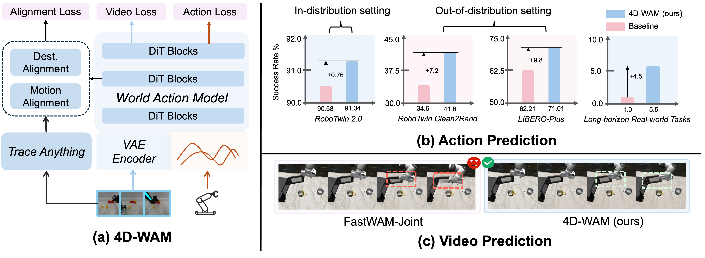

<h1 align="center">4D-WAM: Infusing Spatiotemporal Awareness into World Action Models through Trajectory Fields</h1>

<!-- ## Supplementary Material

This directory contains the supplementary material for the 4D-WAM paper. It is organized to help readers reproduce the main implementations, inspect the additional experimental details, and connect the paper's trajectory-field formulation with the released training and evaluation code. -->

<!-- 

   &ensp;
   &ensp;
   &ensp;

 -->

## What is 4D-WAM?

4D-WAM augments World Action Models (WAMs) with explicit spatiotemporal awareness. Instead of relying only on video latents and action tokens, it introduces trajectory fields that describe how points move through space and time, giving the model a structured signal for object motion, scene dynamics, and action-conditioned change.

  

The method is designed as a lightweight post-training extension for existing WAM backbones. In this repository, 4D-WAM is implemented on top of FastWAM and Lingbot-VA, with preprocessing, training, and evaluation utilities for adding trajectory-field supervision while preserving the original model workflows.

## Supported base WAMs

- [FastWAM](FastWAM/README.md): 4D-WAM implementation built on the FastWAM codebase, including configuration files, training scripts, preprocessing utilities, and evaluation entrypoints for LIBERO and RoboTwin.
- [Lingbot-VA](lingbot-va/README.md): 4D-WAM implementation built on the Lingbot-VA codebase, including data preprocessing, post-training, TraceAnything integration, and simulation evaluation utilities.
 

## Get Started

Start from the README of the base model you want to reproduce:

- **Lingbot-VA**
    - [4DWAM - Lingbot-VA base model](lingbot-va/README.md)
    - [OFFICIAL DOC - Lingbot-VA](lingbot-va/Lingbot-VA-OFFICIAL.md)
- FastWAM
    - [FastWAM base model](FastWAM/README.md)
    - [OFFICIAL DOC - FastWAM](FastWAM/FastWAM-OFFICIAL.md)

⚠️ Note: If you are unfamiliar with the WAM codebase, please consult the official documentation for detailed guidance.
