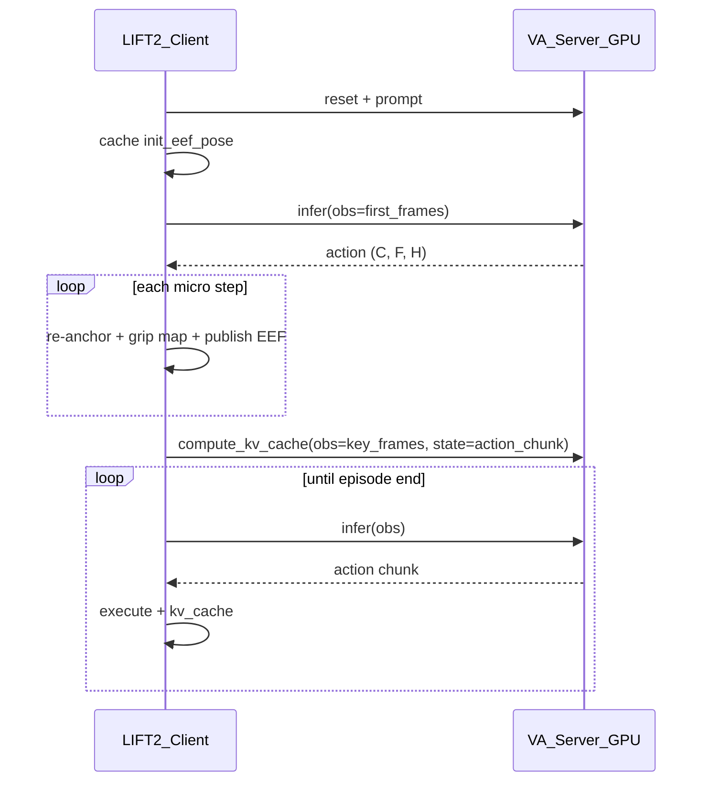

# 4DWAM-on-LIFT2 实施计划

> 状态：**待实现机载包**（GPU 训练 / 数据链路已在本仓库落地；`4DWAM-on-LIFT2/` 部署包尚未创建。）
>
> 关联文档：[`LINGBOT_VA_DATA_CONVERSION.md`](LINGBOT_VA_DATA_CONVERSION.md)
>
> 外部参考：本地 OpenPI checkout 中的 `openpi-on-LIFT2/ANYMODEL_ON_LIFT2_BRIDGE.md`（ROS / profile 模式参考；**动作语义不要照搬**）

---

## 0. 仓库现状（相对旧计划的变更）

| 能力 | 当前仓库状态 | 部署含义 |
|------|--------------|----------|
| LIFT2 HDF5 → LeRobot 转换 | 已有 [`lingbot-va/preprocess/convert_hdf5_to_lingbot_lerobot.py`](../lingbot-va/preprocess/convert_hdf5_to_lingbot_lerobot.py) + YAML | 机载 action 布局必须对齐转换契约 |
| 60 Hz 时间线 | 转换器强制 `source_fps == fps == 60` | 控制频率 / `action_per_frame` 按 60 Hz 数据语义理解 |
| action 归一化统计 | [`compute_action_norm_stats.py`](../lingbot-va/preprocess/compute_action_norm_stats.py) → `meta/action_norm_stats.json` | 推理 `norm_stat` 必须与训练表示一致（段内相对 + 16→30 通道） |
| LIFT2 训练配置 | `lift2_merged_va`、`4dwam_lift2_merged` 等（见 `VA_CONFIGS`） | 继承 `robotwin_tshape`，**不是**独立 `flat224` infer cfg |
| 转换后数据集 | `datasets_converted/lift2_*_step3_compatible_60hz` | 已含 merged / test / longest50 等 |
| checkpoint 目录 | `lingbot-va/checkpoints/lift2_merged_*` | 部署前需选定具体 step |
| 推理服务 | [`wan_va_server.py`](../lingbot-va/wan_va/wan_va_server.py) + WS | 协议已固定；metadata 默认仍为空 |
| 仿真客户端参考 | [`eval_polict_client_openpi.py`](../lingbot-va/evaluation/robotwin/eval_polict_client_openpi.py) | **机载状态机与 re-anchor 逻辑的权威参考** |
| `4DWAM-on-LIFT2/` 包 | **不存在** | 本文档的主要交付物 |

**结论：** 数据与训练侧已可支撑 LIFT2 微调；缺口是 **可拷贝到机载的 VA 协议客户端 + 14D/16D EEF 桥接 + ROS 执行循环**。

---

## 1. 目标

在 **4DWAM** 仓库新建可单独拷贝到 **LIFT2 机载电脑** 的 **`4DWAM-on-LIFT2/`** 包：

| 侧 | 职责 |
|----|------|
| **GPU 机** | `lingbot-va` 的 `VA_Server`（`wan_va_server`）+ WebSocket（`WebsocketPolicyServer`） |
| **机载** | ROS + 自实现 **VA 协议** WebSocket 客户端 + EEF 桥接执行 |

硬约束：

- **不**默认走 openpi 的 `apply_eef_delta` / 预测链 delta 累积。
- 首阶段对齐当前训练管线：`env_type=robotwin_tshape`、三相机、段内相对 EEF + quantile。
- 包内尽量自包含（msgpack / image / policy client），ROS 工具可从 openpi-on-LIFT2 移植并对齐 profile。

---

## 2. 调研：协议、chunk 形状与动作语义

### 2.1 `VA_Server.infer` 三种请求

实现见 [`wan_va_server.py`](../lingbot-va/wan_va/wan_va_server.py) 的 `infer()`：

| 请求 | 关键字段 | 返回 |
|------|----------|------|
| reset | `reset=True`, `prompt` | `{}` |
| infer chunk | `obs`（相机 dict 列表或单帧） | `{action: ndarray}` |
| compute_kv_cache | `compute_kv_cache=True`, `obs`, **`state`** | `{}` |

WebSocket 传输：msgpack + numpy；服务端 `compression=None`，`ping_interval=None`（长推理勿被 ping 掐断）。客户端应对齐 [`websocket_client_policy.py`](../lingbot-va/wan_va/utils/Simple_Remote_Infer/deploy/websocket_client_policy.py) / 仿真侧同名实现。

### 2.2 action chunk 形状（以当前 robotwin / LIFT2 配置为准）

配置来源：[`va_robotwin_cfg.py`](../lingbot-va/wan_va/configs/va_robotwin_cfg.py)（LIFT2 train cfg `update` 自该文件）。

| 项 | 值 | 说明 |
|----|----|------|
| `action_dim` | 30 | 模型内部 multi-embodiment 通道 |
| `used_action_channel_ids` | 16 个索引 | `0–6, 28, 7–13, 29` → 双臂 xyz+quat+grip |
| `frame_chunk_size` | 2 | 视频 latent 帧块 |
| `action_per_frame` | 16 | 每 latent 帧对应 micro-step 数 |
| 服务端 `postprocess_action` 后 | **`(C_used, F, H)` ≈ `(16, 2, 16)`** | 不是 openpi 的 `(H, 14)`；也**不是**简单 `(14, T)` |
| 展平 micro horizon | `F × H`（常从 `F` 的第 1 帧起跳过首帧 padding，见仿真 client） | 列/步展开后供执行器消费 |

仿真客户端对 `action` 的消费方式（权威）：

```text
for frame_i in range(start_idx, F):          # first chunk: start_idx=1
  for micro_j in range(H):
    ee = action[:, frame_i, micro_j]         # C_used 向量
    if C == 16: re-anchor + 下发
    if C == 14: euler→quat 后下发（兼容分支）
```

`T_micro` 若要在文档/metadata 中暴露，建议定义为 **`frame_chunk_size * action_per_frame`**，并同时标明 **layout=`C×F×H`**，避免与 openpi `(H, 14)` 混淆。

### 2.3 动作语义：不是「裸绝对 EEF」，也不是 openpi delta

训练 loader（[`lerobot_latent_dataset.py`](../lingbot-va/wan_va/dataset/lerobot_latent_dataset.py)）在 `env_type == 'robotwin_tshape'` 下：

```text
parquet 14D 绝对 EEF（欧拉）
  → 16D（欧拉→四元数）
  → get_relative_pose：相对「当前 action 段第一帧」的平移/旋转
  → gripper 保持原值（转换阶段已把 LIFT2 grip 映到 [0,1]）
  → 填入 30D + q01/q99 归一化
```

因此 **checkpoint 在物理空间反归一化后，位姿是段内相对量**，不是世界系绝对位姿。

仿真侧对应处理（必须在机载复现）：

- **`C==16`**：`add_init_pose(relative_16d, init_eef_16d)` —— 用 episode 起始 EEF 把相对量加回绝对位姿，再归一化四元数后 `take_action(..., action_type='ee')`。
- **`C==14`**：按欧拉绝对分支处理（兼容；当前 used-channel 路径更常见 16D）。

| 维度 | openpi LIFT2 | 本仓库 VA / 4DWAM（当前） |
|------|--------------|---------------------------|
| 返回字段 | `actions` | `action` |
| 形状 | `(H, 14)` | **`(C_used, F, H)`，C_used 通常 16** |
| 位姿语义 | Δxyz/Δrpy + 绝对归一化 grip | **段内相对 EEF**（反归一化后） |
| 客户端 | 沿预测链 `apply_eef_delta` 累积 | **相对 → 绝对 re-anchor** 后逐步下发 |
| 观测 | `observation.images.*` + `prompt` | `obs` 列表 + `cam_*`；kv 时另传 **`state`** |
| 流式 | 单连接反复 infer | **reset → infer → compute_kv_cache** 循环 |
| RTC | 支持 | **不支持** |
| 默认 WS 端口（config） | 7777 | **`va_shared_cfg.port = 29536`**（启动脚本可用 `--port` / 环境变量覆盖；`run_launch_va_server_sync.sh` 里 `PORT` 默认 1106 需与 client 一致） |

**部署结论（首阶段）：**

- 桥接模式命名建议：**`segment_relative_va`**（不要叫「纯 absolute」）。
- 机载必须缓存 **episode 起始 16D EEF**（或与训练一致的段起点），对每个 micro-step 做 re-anchor。
- **禁止**默认套用 openpi `apply_eef_delta`。
- 若未来改为「存盘绝对 + loader 不做 relative」且 `pose-mode=stored` 重算 norm，再另开 `absolute_stored` 模式。

### 2.4 LIFT2 数据契约（本仓库已固化）

详见 [`LINGBOT_VA_DATA_CONVERSION.md`](LINGBOT_VA_DATA_CONVERSION.md)：

| 契约 | 内容 |
|------|------|
| 时间线 | **60 Hz**，禁止转换器内 60→30 下采样 |
| 存盘 action | 14D **绝对** EEF：`[Lxyz, Lrpy, Lg, Rxyz, Rrpy, Rg]` |
| 存盘 state | `observations/qpos` → 14D `observation.state`（**未**做 grip 归一化） |
| gripper | action 第 6/13 通道默认 **`[0,5] → [0,1]`**；真机下发前再映回机器人 raw（通常 `[0,5]`） |
| 相机 key | `cam_high` / `cam_left_wrist` / `cam_right_wrist`（顺序固定） |
| 训练 norm | 必须对 **loader 变换后** 的表示算 q01/q99（见 `compute_action_norm_stats.py` 的 `segment-relative`） |

HF 公开 `robbyant/robotwin-clean-and-aug-lerobot` 与 RoboTwin 仿真同源语义时，同样是绝对存盘 + loader 段内相对；**不是** openpi 的 `state[t+1]-state[t]` 差分。

### 2.5 `compute_kv_cache` 的 `state`

- `_compute_kv_cache` 调用 `preprocess_action(obs['state'])`，期望与 action 张量同布局的 **物理量纲（反归一化前/后需与服务端 preprocess 约定一致）** 输入。
- 仿真客户端当前传 **`state=action`（上一轮 infer 返回的整块 action chunk）**，而不是 14D joint qpos。
- 机载应 **复刻该约定**；若改为真机 EEF 轨迹回填，必须保证形状为可被 `preprocess_action` 接受的 `(C, F, H)`（或与服务端后续改动同步），且 **禁止**在未改训练的前提下塞 joint 维 state。

### 2.6 相机编码：`robotwin_tshape`（当前 LIFT2 训练实际使用）

[`_encode_obs`](../lingbot-va/wan_va/wan_va_server.py)：

| 模式 | 条件 | 分辨率 | 拼接 |
|------|------|--------|------|
| **tshape（当前）** | `env_type == 'robotwin_tshape'` | high **256×320**；左右腕 **128×160** | 左右腕 latent 横拼，再与 high 竖拼 |
| flat / none | 其他 `env_type` | 各相机统一 `height×width` | 多相机 latent 横拼 |

LIFT2 训练 cfg（如 `va_lift2_merged_train_cfg`、`4dwam_lift2_merged`）均 **继承 robotwin**，因此机载 **首阶段必须 `tshape` 预处理**，不要假设 `flat224`。

`flat224` 仅作为 **后续** 若新增独立 LIFT2 infer/train 分辨率时的选项，需同步改 latent 提取与 norm。

### 2.7 微调策略选择（机载桥接）

| 策略 | 存盘 Parquet | Loader / norm | 机载桥接 |
|------|--------------|---------------|----------|
| **A（当前仓库默认）** | 绝对 14D EEF，60 Hz | 段内相对 + 16/30D + quantile | **`segment_relative_va`** + init pose re-anchor |
| **B（与 openpi 对齐，非默认）** | delta 14D | 改 target + 重算 norm | `delta_openpi` + 预测链累积 |
| **C（存盘绝对且 loader 不 relative）** | 绝对 14D | `pose-mode=stored` 重算 stats | `absolute_stored` 直接下发 |

首阶段只实现 **A**。B/C 需要训练与 norm 全链路一致后再开。

---

## 3. 目标目录结构

```text
4DWAM-on-LIFT2/
  README.md
  requirements-robot.txt          # 机载：websockets, msgpack, numpy, opencv, pyyaml, ...
  launch_profiles.yaml            # host/port、相机 topic、控制频率、bridge 模式、prompt
  dwam_client/
    msgpack_numpy.py              # 可从 Simple_Remote_Infer/deploy 拷贝
    image_tools.py
    base_policy.py
    websocket_va_policy.py        # reset / infer / metadata；ping_interval=None
  deploy/
    client_lift2_dwam.py          # episode 状态机入口
    utils/
      rotation.py                 # quat/euler；对齐 geometry / openpi 工具
      rosoperator.py              # 自 openpi-on-LIFT2 移植
      eef_action_executor.py
      va_observation.py           # ROS → VA obs（tshape 缩放 + key 映射）
      va_action_bridge.py         # (C,F,H) → 绝对 14D/16D 队列 + grip 映射
  docs/
    PROTOCOL.md                   # 与本节 2 对齐的机载可读版
    LIFT2_FINETUNE.md             # 指向仓库数据文档 + 策略 A/B/C
  tests/
    test_va_action_bridge.py      # 无 ROS：形状、re-anchor、grip 映射
    test_msgpack_roundtrip.py
```

可选（GPU 侧，不进机载包）：在 `lingbot-va` 为 LIFT2 增加 **infer-only** config（例如 `lift2_merged_infer`），固定 `resume_from` / `norm_stat` / `port`，避免机载误用 train cfg 副作用。

---

## 4. 实现要点

### 4.1 `websocket_va_policy.py`

- 连接：`compression=None`，`ping_interval=None`，`max_size=None`
- 握手后读取 server metadata（当前服务端常为 `{}`）；缺失时回退 `launch_profiles.yaml`
- API：
  - `reset(prompt)` → `{"reset": True, "prompt": prompt}`
  - `infer(obs_dict)` → 含 **`action`** 的 dict
  - `compute_kv_cache(obs_list, state)` → `{"compute_kv_cache": True, "obs": ..., "state": ...}`
- 不要假设 openpi 的 `actions` 字段名

### 4.2 `va_observation.py`

- LIFT2 `RosOperator` 图像 → VA keys：
  - `observation.images.cam_high`
  - `observation.images.cam_left_wrist`
  - `observation.images.cam_right_wrist`
- **`tshape`（默认）**：high 256×320，腕 128×160，uint8 RGB，与 `_encode_obs` 一致
- 组装 `format_obs` 风格 dict；`infer` 时 `obs` 可为单 dict 或 list（与仿真一致）
- 记录 episode 起始 EEF（16D：左右 xyz+quat+grip）供 bridge re-anchor

### 4.3 `va_action_bridge.py`

- 输入：`action`，形状 `(C, F, H)`
- 展开 micro-step 队列；首 chunk 是否跳过 `frame_i==0` 与仿真 `start_idx` 对齐（可配置）
- **`segment_relative_va`**：
  - `C==16`：`add_init_pose` 等价逻辑 → 绝对 16D → 转 LIFT2 控制用 14D 欧拉（若执行器要欧拉）
  - gripper：模型侧 **`[0,1]`** → 机器人 raw（profile 配置，默认 `[0,5]`），可选步长限幅
- **`delta_openpi` / `absolute_stored`**：仅占位或显式 NotImplemented，直到训练策略切换
- `execute_horizon` 耗尽后由 client 触发 **kv_cache + 下一轮 infer**

### 4.4 `client_lift2_dwam.py`

状态机对齐仿真 [`eval_polict_client_openpi.py`](../lingbot-va/evaluation/robotwin/eval_polict_client_openpi.py)：



- 复用 openpi-on-LIFT2 的 ROS / executor / `launch_profiles.yaml` 模式（话题名可覆盖）
- 控制频率：数据为 **60 Hz** 语义；若真机控制环 30 Hz，在 profile 中明确 **降采样或按 micro-step 时间戳**，禁止静默错频
- 支持 `--dry-run`：只连 WS、reset、单次 infer、打印 `action.shape` 与 re-anchor 后数值范围

### 4.5 GPU 侧

启动示例（仓库约定用 `uv`）：

```bash
# 示例：按实际 checkpoint / config 名修改
NGPU=1 CONFIG_NAME=robotwin PORT=29536 \
  uv --directory /soft/wangxi/4DWAM/lingbot-va run \
  bash script/run_launch_va_server_sync.sh \
  # 或 python -m wan_va.wan_va_server --config-name <name> --port 29536
```

可用 config 名见 [`configs/__init__.py`](../lingbot-va/wan_va/configs/__init__.py)：

- 推理基座：`robotwin` / `franka`（infer_mode=server）
- LIFT2 训练：`lift2_merged_va`、`4dwam_lift2_merged`、`4dwam_*_test` 等（**需确认 `infer_mode` 与权重路径**；train cfg 默认不一定可直接当 server 用，优先做 thin infer cfg）

建议增强（可选小改）：

- `run_async_server_mode` / `WebsocketPolicyServer` 填充 metadata：

```yaml
action_layout: "C_F_H"
C_used: 16
frame_chunk_size: 2
action_per_frame: 16
env_type: robotwin_tshape
camera_mode: tshape
bridge_hint: segment_relative_va
action_key: action
```

- 保证 LIFT2 checkpoint 的 `norm_stat` 来自对应数据集的 `meta/action_norm_stats.json`（与 `action_dim=30` 等长）

---

## 5. 实现任务清单

### Phase 0 — 对齐与文档（本文件 + 机载 PROTOCOL）

- [ ] 固化策略 **A = segment_relative_va**；在 `LIFT2_FINETUNE.md` 链到 `LINGBOT_VA_DATA_CONVERSION.md`
- [ ] 确认目标 checkpoint：config 名、`norm_stat` 路径、`env_type`、相机模式
- [ ] 确认机载 ROS 话题 / 控制频率 / gripper raw 范围（写入 `launch_profiles.yaml`）

### Phase 1 — `4DWAM-on-LIFT2/` 骨架

- [ ] 创建目录、`README.md`、`requirements-robot.txt`、`launch_profiles.yaml`
- [ ] 实现 `dwam_client/{msgpack_numpy,image_tools,base_policy,websocket_va_policy}.py`
- [ ] 单测：msgpack roundtrip；无 GPU mock pack/unpack

### Phase 2 — 观测 / 动作桥 / 客户端

- [ ] 移植 `rotation` / `rosoperator` / `eef_action_executor`（对齐 openpi-on-LIFT2，去掉 delta 默认路径）
- [ ] 实现 `va_observation.py`（**tshape**）
- [ ] 实现 `va_action_bridge.py`（`(C,F,H)`、re-anchor、grip 映射、可选 skip first frame）
- [ ] 实现 `client_lift2_dwam.py`（reset → chunk 执行 → kv_cache 循环）
- [ ] 无 ROS 单测：固定 `init_pose` + 假 action，检查绝对位姿连续性

### Phase 3 — GPU 联调

- [ ] 启动 `wan_va_server`，client `--dry-run` 打印 `action.shape`（期望 16×2×16 或与 cfg 一致）
- [ ] 可选：server metadata 暴露 layout
- [ ] 真机：按 profile 频率发布；**禁止**每步用当前 state 重锚定相对量（只用 episode/段起点）

### Phase 4 — 后续（非首阶段阻塞）

- [ ] 独立 `lift2_*_infer` cfg（固定权重与 norm）
- [ ] 若分辨率策略变更：`flat224` + 重提 latent + 重算 norm + 新 bridge profile
- [ ] 策略 B/C 的训练与桥接（显式开关，默认关闭）

---

## 6. 验证清单

| 级别 | 检查项 |
|------|--------|
| 单元 | bridge 将 `(16,2,16)` 相对量 + `init_pose` 变为合理绝对 EEF；grip `[0,1]→[0,5]` |
| 单元 | 首 chunk `start_idx` 行为与仿真一致（可配置） |
| 集成 | `--dry-run`：reset / infer / 可选 kv_cache 不抛错 |
| 集成 | `action` 字段存在；shape 与 metadata/profile 声明一致 |
| 真机 | 绝对轨迹平滑，无 openpi 式逐步 delta 叠爆 |
| 真机 | kv_cache 的 `state` 与训练约定一致（默认整块 action chunk） |
| 回归 | 更换 checkpoint 后必须核对 `norm_stat` 与 `env_type` |

---

## 7. 风险与假设

| ID | 类型 | 内容 |
|----|------|------|
| H1 | 假设 | 首阶段 checkpoint 为 **robotwin_tshape + 段内相对 EEF**（LIFT2 merged / 4DWAM 同族） |
| H2 | 假设 | ROS 话题默认与 ANYMODEL / openpi-on-LIFT2 一致，可用 profile 覆盖 |
| H3 | 假设 | 机载可提供与训练一致的 **起始 EEF**（左右臂 + grip） |
| R1 | 风险 | 把相对量当绝对量下发 → 轨迹整体偏移或发散 |
| R2 | 风险 | `compute_kv_cache` 误传 joint qpos 或错误 shape → KV 污染 |
| R3 | 风险 | 使用 train cfg 默认 `norm_stat`（robotwin 公开统计）跑 LIFT2 权重 → 动作尺度错误 |
| R4 | 风险 | 控制频率 30 Hz vs 数据 60 Hz 未声明 → 时序错位 |
| R5 | 风险 | 服务端 metadata 为空时 client 写死错误 `C/F/H` |

---

## 8. 相关路径索引

| 用途 | 路径 |
|------|------|
| 数据转换契约 | [`docs/LINGBOT_VA_DATA_CONVERSION.md`](LINGBOT_VA_DATA_CONVERSION.md) |
| HDF5→LeRobot | [`lingbot-va/preprocess/convert_hdf5_to_lingbot_lerobot.py`](../lingbot-va/preprocess/convert_hdf5_to_lingbot_lerobot.py) |
| action norm 统计 | [`lingbot-va/preprocess/compute_action_norm_stats.py`](../lingbot-va/preprocess/compute_action_norm_stats.py) |
| 训练 loader / 段内相对 | [`lingbot-va/wan_va/dataset/lerobot_latent_dataset.py`](../lingbot-va/wan_va/dataset/lerobot_latent_dataset.py) |
| 推理服务 | [`lingbot-va/wan_va/wan_va_server.py`](../lingbot-va/wan_va/wan_va_server.py) |
| WS 服务 | [`lingbot-va/wan_va/utils/Simple_Remote_Infer/deploy/websocket_policy_server.py`](../lingbot-va/wan_va/utils/Simple_Remote_Infer/deploy/websocket_policy_server.py) |
| WS 客户端参考 | [`lingbot-va/wan_va/utils/Simple_Remote_Infer/deploy/websocket_client_policy.py`](../lingbot-va/wan_va/utils/Simple_Remote_Infer/deploy/websocket_client_policy.py) |
| 共享 host/port | [`lingbot-va/wan_va/configs/shared_config.py`](../lingbot-va/wan_va/configs/shared_config.py) |
| RobotWin / 默认相机与 action 布局 | [`lingbot-va/wan_va/configs/va_robotwin_cfg.py`](../lingbot-va/wan_va/configs/va_robotwin_cfg.py) |
| LIFT2 VA 训练 cfg | [`lingbot-va/wan_va/configs/va_lift2_merged_train_cfg.py`](../lingbot-va/wan_va/configs/va_lift2_merged_train_cfg.py) |
| LIFT2 4DWAM 训练 cfg | [`lingbot-va/wan_va/configs/config4dwam/train4dwam_lift2_merged.py`](../lingbot-va/wan_va/configs/config4dwam/train4dwam_lift2_merged.py) |
| config 注册表 | [`lingbot-va/wan_va/configs/__init__.py`](../lingbot-va/wan_va/configs/__init__.py) |
| 仿真 episode 状态机 | [`lingbot-va/evaluation/robotwin/eval_polict_client_openpi.py`](../lingbot-va/evaluation/robotwin/eval_polict_client_openpi.py) |
| 启动脚本 | [`lingbot-va/script/run_launch_va_server_sync.sh`](../lingbot-va/script/run_launch_va_server_sync.sh) |
| 转换数据根目录 | `datasets_converted/lift2_*_step3_compatible_60hz` |
| ROS 桥接参考（外部） | 本地 `openpi-on-LIFT2/ANYMODEL_ON_LIFT2_BRIDGE.md` |

---

## 9. 建议落地顺序（最短路径）

1. **无 ROS**：bridge 单测（16D re-anchor + grip）
2. **有 GPU**：`websocket_va_policy` dry-run 打通 reset/infer
3. **有 ROS 无执行**：只订阅相机 / 打印将发 EEF
4. **真机低速**：降 `execute_horizon` 或限速发布，再拉满 profile 频率
5. 再考虑 metadata、独立 infer cfg、策略 B/C

机载包落地后，将本文件状态改为 **进行中/已完成**，并在 `4DWAM-on-LIFT2/README.md` 保留一份精简操作说明即可。
