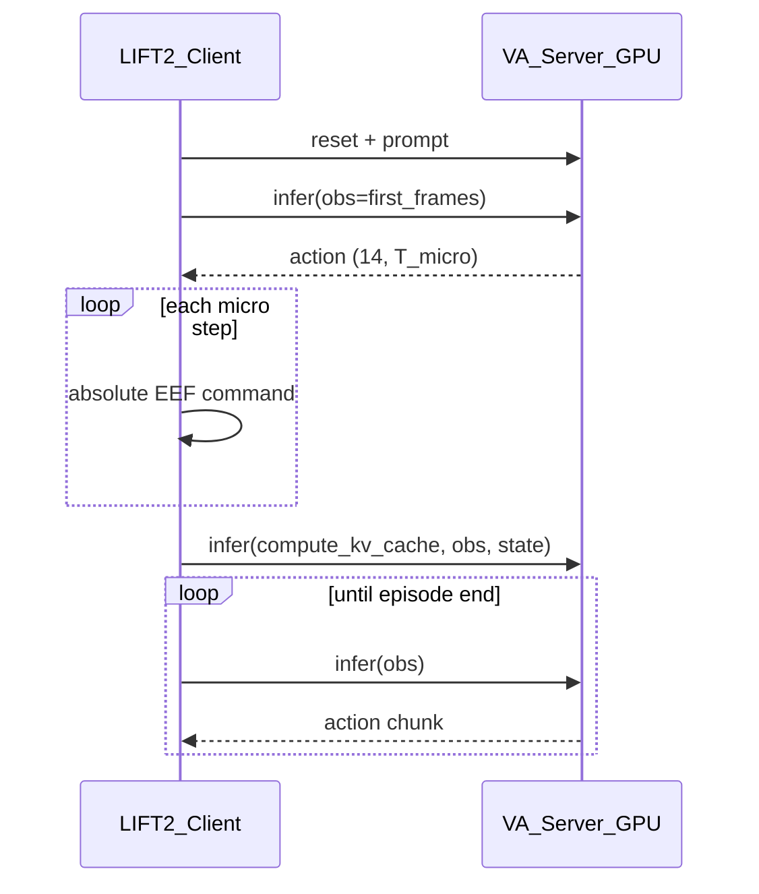

# 4DWAM-on-LIFT2 实施计划

> 状态：**待实现**（本文档为设计与调研归档，确认后按章节落地代码。）  
> 参考：本地 OpenPI checkout 中的 `openpi-on-LIFT2/ANYMODEL_ON_LIFT2_BRIDGE.md`

---

## 1. 目标

在 **4DWAM** 仓库新建可单独拷贝到 **LIFT2 机载电脑** 的 **`4DWAM-on-LIFT2/`** 包：

- **GPU 机**：`lingbot-va` 的 `wan_va_server`（`VA_Server` + WebSocket）
- **机载**：ROS + 自实现 **VA 协议** WebSocket 客户端 + 14D EEF 桥接（**不**走 openpi delta 累积，除非 LIFT2 微调改为 delta 管线）

---

## 2. 调研：action chunk 与动作语义

### 2.1 VA_Server 是否输出 action chunk？

**是。** 每次 `infer`（非 `reset` / 非 `compute_kv_cache`）返回：

```python
return dict(action=action)  # numpy, shape (C_used, T_micro)
```

| 项 | 说明 |
|----|------|
| `C_used` | 14（`used_action_channel_ids`） |
| `T_micro` | `frame_chunk_size × action_per_frame`（RobotWin 默认 **2×16=32**） |
| 语义 | **绝对 EEF**（`postprocess_action` 反 quantile 后物理量纲） |

仿真流程见 [`lingbot-va/evaluation/robotwin/eval_polict_client_openpi.py`](lingbot-va/evaluation/robotwin/eval_polict_client_openpi.py)：`reset` → 首帧 `infer` → 执行 chunk → `compute_kv_cache` → 循环 `infer`。



### 2.2 与 openpi LIFT2 的差异

| 维度 | openpi LIFT2 | 4DWAM / VA_Server |
|------|--------------|-------------------|
| 返回字段 | `actions` | `action` |
| 形状 | `(H, 14)` | **`(14, T)`** |
| 语义 | Δxyz/Δrpy + 绝对归一化 grip | **绝对** EEF |
| 客户端 | `apply_eef_delta` 沿预测链累积 | **直接下发**每步 |
| 观测键 | `observation.images.*` + `prompt` | `obs` 列表 + `cam_*` + **`task`**；kv 时 **`state`** |
| 流式 | 单连接反复 infer | **reset → infer → compute_kv_cache** |
| RTC | 支持 | **不支持** |
| 默认端口 | 7777 | **29536**（`shared_config`） |

### 2.3 HuggingFace `robbyant/robotwin-clean-and-aug-lerobot`

- 卡片未写明 absolute/delta；结合 Dataset Viewer（`action` 与 `state` 同帧接近）及 [lingbot-vla `robotwin.yaml`](https://github.com/Robbyant/lingbot-vla/blob/main/configs/robot_configs/robotwin.yaml)（**`subtract_state: False`**）：
  - **Parquet 存逐步绝对 14D EEF**（仿真 RoboTwin，非 LIFT2 真机）。
- **不是** openpi 的 `action[t] = state[t+1] - state[t]` 差分。

### 2.4 Lingbot-VA 训练 loader 再处理

[`lingbot-va/wan_va/dataset/lerobot_latent_dataset.py`](lingbot-va/wan_va/dataset/lerobot_latent_dataset.py) 在 `robotwin_tshape` 下对 16D（14D→四元数）做 **`get_relative_pose`**：

- 平移/旋转：**相对 `action_config` 段内第一帧**（段内相对，非帧间 delta）
- 夹爪：保持 parquet 原值
- 再用 [`va_robotwin_cfg.py`](lingbot-va/wan_va/configs/va_robotwin_cfg.py) 的 **q01/q99** quantile 归一化

[lingbot-va#36](https://github.com/Robbyant/lingbot-va/issues/36)：**norm 统计量必须与归一化前的动作表示一致**。

**部署结论：** 接 Lingbot/RobotWin checkpoint 时，机载用 **`absolute_va`** 桥接；**不要**套用 openpi `apply_eef_delta`。

### 2.5 LIFT2 LeRobot v2.1 微调时二选一

| 策略 | Parquet | Loader | 机载桥接 |
|------|---------|--------|----------|
| **A（与现 VA 一致）** | 绝对 14D | 可选段内相对 + quantile | `absolute_va` |
| **B（与 openpi 一致）** | delta | 改训练 target + norm_stats | `delta_openpi` + 预测链累积 |

---

## 3. 目标目录结构

```text
4DWAM-on-LIFT2/
  README.md
  requirements-robot.txt
  launch_profiles.yaml
  dwam_client/
    msgpack_numpy.py
    image_tools.py
    base_policy.py
    websocket_va_policy.py
  deploy/
    client_lift2_dwam.py
    utils/
      rotation.py
      rosoperator.py
      eef_action_executor.py
      va_observation.py
      va_action_bridge.py
  docs/
    PROTOCOL.md
    LIFT2_FINETUNE.md
```

---

## 4. 实现要点

### 4.1 `websocket_va_policy.py`

- `compression=None`，`ping_interval=None`
- `reset(prompt)` → `{"reset": True, "prompt": prompt}`
- `infer(obs_dict)` → 返回含 **`action`** 的 dict
- metadata 缺失时回退 `launch_profiles.yaml`

### 4.2 `va_observation.py`

- LIFT2 `RosOperator` → VA `obs` 列表
- **`tshape`**：head 256×320，腕 128×160（对齐 robotwin / `_encode_obs`）
- **`flat224`**：三路 224 pad-resize（目标 LIFT2 + `va_lift2_cfg`）
- `compute_kv_cache`：`obs` + **`state`** 14D 物理 EEF

### 4.3 `va_action_bridge.py`

- 将 **`action (14, T)`** 列展开为绝对 14D 队列
- `execute_horizon` 消费后触发 **kv_cache + infer**
- 模型/VA 协议侧 gripper 保持 **归一化 `[0, 1]`**；真机下发前再映射回 LIFT2 机器人侧 raw gripper 范围（通常 `[0, 5]`），可选步长限幅

### 4.4 `client_lift2_dwam.py`

- 复用 openpi-on-LIFT2 的 ROS / executor / profile 模式
- Episode 状态机对齐 `eval_polict_client_openpi.py`

### 4.5 GPU 侧（文档 + 可选小改）

- 启动：[`lingbot-va/script/run_launch_va_server_sync.sh`](lingbot-va/script/run_launch_va_server_sync.sh)
- 建议 `WebsocketPolicyServer` 增加 **metadata**：`T_micro`、`action_layout: 14xT`、`camera_mode`

---

## 5. 实现任务清单（Todos）

- [ ] 创建 `4DWAM-on-LIFT2/` 目录、README、`requirements-robot.txt`、`launch_profiles.yaml`、`docs/PROTOCOL.md`、`docs/LIFT2_FINETUNE.md`
- [ ] 实现 `dwam_client/{msgpack_numpy,image_tools,base_policy,websocket_va_policy}.py`
- [ ] 移植/对齐 `deploy/utils`（rotation、rosoperator、eef_action_executor）；新增 `va_observation.py`、`va_action_bridge.py`
- [ ] 实现 `deploy/client_lift2_dwam.py`（reset → chunk → kv_cache 循环）
- [ ] 文档说明 GPU 启动与 metadata；可选改 `wan_va_server` 暴露元数据
- [ ] （后续）新增 `va_lift2_cfg` + LeRobot v2.1 三相机训练与 `norm_stat`，机载 `flat224` 对齐
- [ ] 在 `LIFT2_FINETUNE.md` 固化：HF parquet=绝对 14D；Lingbot loader=段内相对；与 openpi delta 的策略选择

---

## 6. 验证清单

- 无 ROS：mock 测 pack/unpack 与 bridge `(14, T)` 形状
- 有 GPU：`--dry-run` 连 WS、reset、单次 infer 打印 `action.shape`
- 真机：30Hz 发布；绝对 chunk 不应每步用真机 state 重锚定

---

## 7. 风险与假设

- **假设 1**：首阶段 checkpoint 为 **绝对 EEF** 输出（robotwin / franka 或未来 lift2 absolute）
- **假设 2**：ROS 话题默认与 ANYMODEL 一致，可在 `launch_profiles.yaml` 覆盖
- **风险**：`compute_kv_cache` 的 `state` 维度和训练不一致（joint vs EEF）会破坏 KV；强制 **14D EEF 物理量纲**

---

## 8. 相关路径索引

| 用途 | 路径 |
|------|------|
| 推理服务 | [`lingbot-va/wan_va/wan_va_server.py`](lingbot-va/wan_va/wan_va_server.py) |
| WS 服务 | [`lingbot-va/wan_va/utils/Simple_Remote_Infer/deploy/websocket_policy_server.py`](lingbot-va/wan_va/utils/Simple_Remote_Infer/deploy/websocket_policy_server.py) |
| 训练数据 | [`lingbot-va/wan_va/dataset/lerobot_latent_dataset.py`](lingbot-va/wan_va/dataset/lerobot_latent_dataset.py) |
| RobotWin 推理配置 | [`lingbot-va/wan_va/configs/va_robotwin_cfg.py`](lingbot-va/wan_va/configs/va_robotwin_cfg.py) |
| LIFT2 桥接参考 | 本地 OpenPI checkout 中的 `openpi-on-LIFT2/ANYMODEL_ON_LIFT2_BRIDGE.md` |
